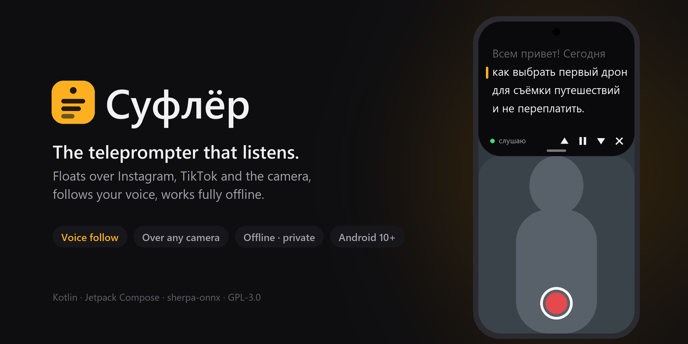
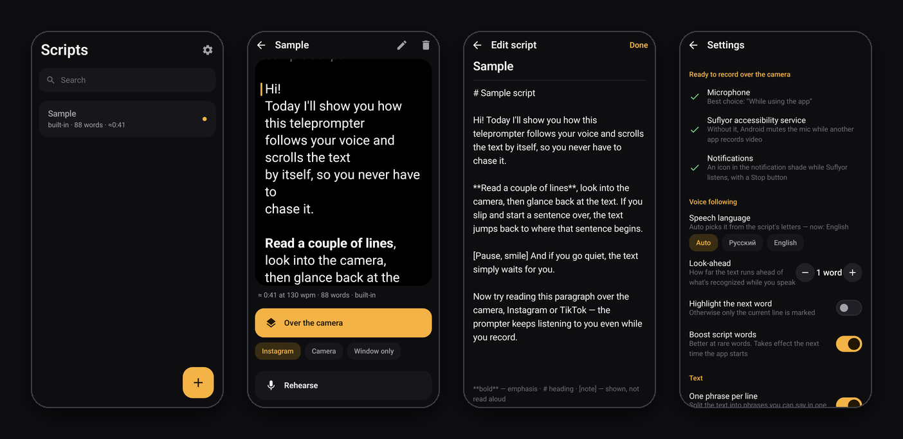
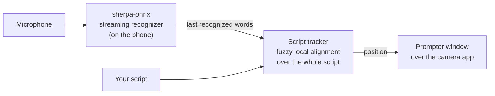

<p align="center">
  
</p>

<h1 align="center">Suflyor — voice-following teleprompter for Android</h1>

<p align="center">
  <a href="https://github.com/olerast67/voice-teleprompter-android/releases/latest"></a>
  <a href="https://github.com/olerast67/voice-teleprompter-android/releases"></a>
  <a href="https://github.com/olerast67/voice-teleprompter-android/actions/workflows/ci.yml"></a>
  <a href="LICENSE"></a>
  
  <a href="PRIVACY.md"></a>
</p>

<p align="center">
  <a href="https://github.com/olerast67/voice-teleprompter-android/releases/latest"></a>
  &nbsp;
  <a href="https://apps.obtainium.imranr.dev/redirect.html?r=obtainium://add/https://github.com/olerast67/voice-teleprompter-android"></a>
</p>

<p align="center"><b>English</b> · <a href="README.ru.md">Русский</a> · <a href="https://olerast67.github.io/voice-teleprompter-android/">Website</a></p>

---

**Suflyor** (Russian *суфлёр*, "prompter") is a free, open-source **teleprompter app for Android that follows your voice**. It floats over Instagram, TikTok or the camera app and scrolls the script as you speak, so you never chase the text: a voice-activated teleprompter for Reels, Shorts and TikToks. It works fully offline, and the app has no internet permission at all.

It is made for creators who hold the phone, read a couple of lines to the lens, look back at the text and carry on. If you stumble and start a sentence again, the text goes back with you. If you skip a paragraph, it catches up.

> [!NOTE]
> **Works in English and Russian.** The interface follows your phone's language, and Suflyor picks the speech language from your script's letters (or set it in Settings). More languages are on the [roadmap](#roadmap).

## Screenshots

<p align="center">
  
</p>

| Library | Script | Editor | Settings |
|:---:|:---:|:---:|:---:|
| All your scripts, imported from almost any format | Preview, reading time and one tap to start over the camera | Plain text with `**emphasis**`, `# headings` and `[notes]` | Text size, speed, remotes, sound source |

## Features

**Follows your voice**
- On-device streaming speech recognition for **English and Russian** ([sherpa-onnx](https://github.com/k2-fsa/sherpa-onnx)). No cloud, no account, no delay from the network.
- Understands how people read English: contractions (don't, it's), numbers written as digits but said as words, abbreviations (Mr., Dr.), acronyms (AI, CEO) and "um"s.
- Searches the whole script, not only the next few words. Rare words count more than common ones, so it doesn't jump on every "and".
- Re-reading a line brings the text back to it after about two words. A skipped block is found after three or four.
- Pauses and off-script talk leave the text where it is.
- Lines you have read dim away. `[Stage directions in brackets]` stay visible but are never expected to be spoken.

**Floats over any camera app**
- Keeps listening while Instagram, TikTok or the stock camera records video. The mic isn't taken away from the prompter, and your reel still gets the sound.
- The text starts right under the front camera, so your eyes stay near the lens. The controls sit at the bottom.
- **Lock mode:** touches pass through the window to the camera's own buttons.
- **Landscape:** the window moves next to the lens and turns the text, even when the camera app keeps the screen in portrait.
- **Quick Settings tile:** starts the prompter over whatever app is open.

**Remotes and scrolling**
- Volume keys, Bluetooth selfie remotes, rings, clickers and keyboards. Each key can be assigned in Settings.
- Timed scrolling at a set speed, with a 3-2-1 countdown, when you'd rather not use your voice.
- Rehearsal mode: a full-screen prompter inside the app.

**Imports almost anything**
- TXT (UTF-8, UTF-16, Windows-1251, KOI8-R), Markdown and Obsidian notes, DOCX, ODT, RTF, HTML and PDF.
- Open from other apps with *Share* or *Open with*, paste from the clipboard, or type in the editor.
- Long paragraphs are split into short phrases you can read in one breath.

## How it works



The tracker aligns the last few recognized words against the entire script. It keeps only matches that end on one of the last two words you said (the newest counts more), and it weighs every word by how rare it is in your script. Small steps forward need a single good match. Going back to a nearby line needs about two words from its start. A far jump needs at least three words and a clear lead over every other place in the script; unless the match is very strong, it also waits for the next update to agree.

## Privacy

**Everything stays on your phone.** The app does not have the `INTERNET` permission, so Android won't let it connect anywhere, and you can check this yourself.

- Audio is used only while a prompter session is running. It is never recorded, stored or sent.
- The accessibility service is active only during a session. It **cannot read screen content**. It keeps the microphone working while other apps record, shows the floating window, and handles volume and remote-control keys (on by default with a preset set of keys; you can turn this off or reassign the keys in Settings).
- No analytics, no ads, no accounts, no trackers.

The details are in [PRIVACY.md](PRIVACY.md).

## Install

**Requirements:** Android 10 or newer on a 64-bit ARM phone (almost every phone since 2017), about 130 MB of space: both speech models are inside the app. Tested on a Samsung Galaxy S24 FE with One UI 6.1 (Android 14).

1. Download `Suflyor-<version>.apk` from [Releases](https://github.com/olerast67/voice-teleprompter-android/releases/latest) and open it. Allow your browser or file manager to install apps when asked.
2. Open Suflyor and allow the **microphone**.
3. Turn on the accessibility service **“Suflyor: floating window and voice”** (on a Russian phone: «Суфлёр: окно поверх и голос»). The app takes you to the right screen.
   - On Android 13 and newer, apps installed from a file can't use accessibility at first, and the switch is greyed out. Go to **Settings → Apps → Suflyor → ⋮ → Allow restricted settings**, then turn the service on again.
4. On a script, choose Instagram, TikTok or Camera under the **Over the camera** button, tap the button and start reading.

**Language:** the app follows your phone's language; on Android 13 and newer you can pick English or Russian just for Suflyor in **Settings → App language**. The speech language is separate: Auto picks it for each script from its letters, or fix it in **Settings → Speech language** (Auto, Русский, English).

**Updates:** new versions install over the old one. With [Obtainium](https://github.com/ImranR98/Obtainium) you get them automatically from this repository.

### If Android says the developer isn't verified

Google is rolling out [developer verification](https://developer.android.com/developer-verification). In 2026 it doesn't affect installs from GitHub or Obtainium. From 2027, phones with Google services install apps from developers who are not yet verified only after a one-time setting (the "advanced flow"):

1. Turn on **Developer options**: Settings → About phone → tap **Build number** seven times (on Samsung: About phone → Software information → Build number).
2. In **Developer options**, turn on **Allow apps from unverified developers** and confirm with your screen lock. Android also asks you to confirm that nobody is guiding you through this: it is a protection against scams.
3. Restart the phone and **wait 24 hours**. This safety delay happens once.
4. Open the setting again, confirm, and choose **indefinitely** (or 7 days).
5. Install the APK and tap **Install anyway**.

Also works: installing from a computer with `adb install Suflyor-<version>.apk`, with no waiting. Phones without Google services (LineageOS without GApps, Huawei) are not affected.

## Verify your download

Release APKs are built by [GitHub Actions](.github/workflows/release.yml) from the tagged source. Each release carries a `SHA256SUMS.txt` file and a signed build-provenance attestation. All releases are signed with the same key; the SHA-256 fingerprint of its certificate is:

```
77:F3:94:32:F5:05:FB:B7:8B:85:E7:37:CD:00:21:0A:44:C0:7A:13:2C:AC:FF:81:FE:9D:9D:79:CD:E9:A9:06
```

```bash
# The certificate must match the SHA-256 above:
apksigner verify --print-certs Suflyor-*.apk
# Proves the APK was built by this repository's workflow:
gh attestation verify Suflyor-*.apk --owner olerast67
```

[AppVerifier](https://github.com/soupslurpr/AppVerifier) can check the certificate on the phone.

## Build from source

You need JDK 17 and the Android SDK (platform 36).

```bash
git clone https://github.com/olerast67/voice-teleprompter-android.git
cd suflyor
./gradlew assembleDebug testDebugUnitTest
```

- **Downloads on first build.** The speech library (sherpa-onnx 1.13.8, ~50 MB), the Russian model (~28 MB) and the English model (~73 MB) are not stored in git. The `fetchSpeechAssets` task downloads them from pinned revisions and checks every file against a pinned SHA-256.
- **Release builds** (`./gradlew assembleRelease`) are signed only when a key is configured, through `keystore.properties` or the `SUFLYOR_*` environment variables. Without a key they come out unsigned. See [RELEASING.md](RELEASING.md).
- **On Windows,** `.\build.ps1` and `.\install.ps1` read `sdk.dir` and `jdk.dir` from `local.properties`.

<details>
<summary>Project layout</summary>

| Path | What's there |
|---|---|
| `app/src/main/java/.../ui` | Jetpack Compose screens: library, script, rehearsal, editor, settings, journal |
| `.../overlay` | Floating window, accessibility service, prompter view, Quick Settings tile |
| `.../track/ScriptTracker.kt` | Voice-following: word alignment against the script |
| `.../speech` | Microphone capture and sherpa-onnx recognizer |
| `.../session` | Session engine and foreground service |
| `.../doc` | Importers: TXT, Markdown, DOCX, ODT, RTF, HTML, PDF |
| `.../script` | Word normalization and phrase layout |
| `app/src/test` | Unit tests for the tracker (with a random stress test) and importers |

</details>

## Roadmap

- **Language packs:** Spanish, German, Italian, Polish, Vietnamese and other languages that have compact streaming models. They will be files you open with the app, so it still needs no internet permission and the APK doesn't grow.
- Mirror mode for beam-splitter teleprompter glass.

Ideas and votes are welcome in [Issues](https://github.com/olerast67/voice-teleprompter-android/issues).

## FAQ

<details>
<summary><b>Is there a teleprompter app for Android that follows your voice?</b></summary>

Yes: Suflyor listens through the microphone and scrolls to the words you are saying. It is free and open source, and the speech recognition runs on the phone.
</details>

<details>
<summary><b>Can I use a teleprompter while recording in Instagram, TikTok or the camera app?</b></summary>

Yes. Suflyor floats over any app, and its text starts right under the front camera. Android normally takes the microphone away from other apps while a camera app records; Suflyor's accessibility service is what lets it keep listening (the reel still gets its sound).
</details>

<details>
<summary><b>Does it work offline? Is my voice sent anywhere?</b></summary>

It works fully offline. The app has no internet permission, so it can't send anything anywhere; audio is never recorded or stored. See [PRIVACY.md](PRIVACY.md).
</details>

<details>
<summary><b>Which languages does it understand?</b></summary>

English and Russian speech, picked automatically from the script or set in Settings. The interface is in English and Russian. More languages are planned as downloadable packs.
</details>

<details>
<summary><b>Does it work with a Bluetooth remote?</b></summary>

Yes: volume keys, Bluetooth selfie remotes, rings, presentation clickers and keyboards can pause, go back or forward a line. Keys can be reassigned. Timed scrolling with a 3-2-1 countdown is there too.
</details>

<details>
<summary><b>Is it free? Is there a Pro version?</b></summary>

Free, with no ads, no accounts and no paid features. The code is GPL-3.0. If it helps you, you can [support it](DONATE.md).
</details>

<details>
<summary><b>Which phones are supported? Is there an iPhone version?</b></summary>

Android 10 or newer on a 64-bit ARM phone (almost every phone since 2017). There is no iOS version: iOS doesn't let an app float a window over other apps the way Suflyor needs.
</details>

## Support the project

Suflyor is free and always will be: no ads, no paywalls, no "pro" version. If it saves you retakes, you can support its development. Every donation goes into more languages and more devices to test on.

<a href="https://boosty.to/olerast/donate"></a>
&nbsp;
<a href="DONATE.md"></a>

Starring the repository and telling other creators about it helps too.

## Contributing

Bug reports from different phones are the most valuable help. Attach the in-app log: **Settings → Log → Share**. See [CONTRIBUTING.md](CONTRIBUTING.md) for building, code style and adding a language. Report security problems privately, as described in [SECURITY.md](SECURITY.md).

## Credits

- [sherpa-onnx](https://github.com/k2-fsa/sherpa-onnx) by the k2-fsa team: streaming speech recognition (Apache-2.0).
- [vosk-model-small-streaming-ru](https://huggingface.co/alphacep/vosk-model-small-streaming-ru) by Alpha Cephei: the Russian model (Apache-2.0).
- The [icefall](https://github.com/k2-fsa/icefall) streaming Zipformer trained on LibriSpeech: the English model (Apache-2.0).
- [ONNX Runtime](https://github.com/microsoft/onnxruntime) (MIT), Jetpack Compose (Apache-2.0).
- The full list is in [THIRD_PARTY_NOTICES.md](THIRD_PARTY_NOTICES.md).

**How this was made:** the author designed the app, directed it and tested it on a real phone. Much of the code was written with an AI coding assistant (Claude by Anthropic). The voice tracker (in both languages) and the importers are covered by unit tests in `app/src/test`.

## License

[GNU General Public License v3.0](LICENSE). You may use, study, share and modify Suflyor. Modified versions you distribute must stay open source under the same license.
