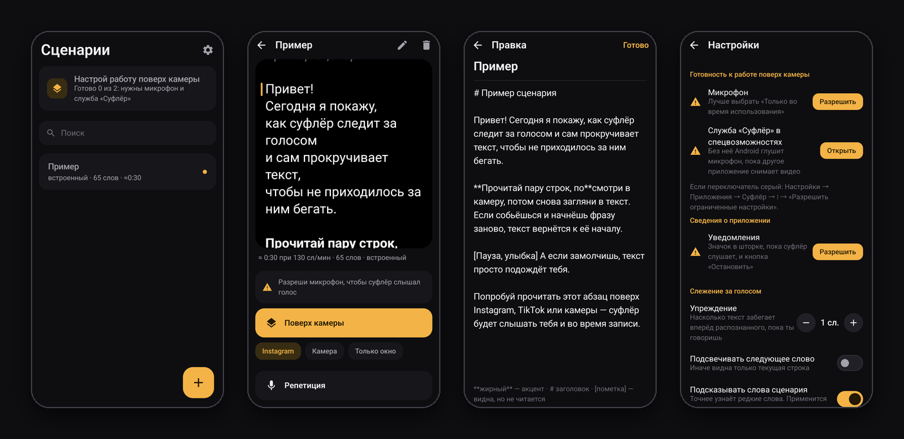
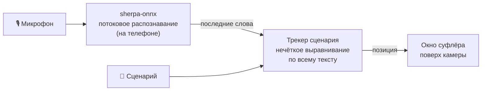

<p align="center">
  
</p>

<h1 align="center">Суфлёр — телесуфлёр для Android, который слышит голос</h1>

<p align="center">
  <a href="https://github.com/olerast67/voice-teleprompter-android/releases/latest"></a>
  <a href="https://github.com/olerast67/voice-teleprompter-android/releases"></a>
  <a href="https://github.com/olerast67/voice-teleprompter-android/actions/workflows/ci.yml"></a>
  <a href="LICENSE"></a>
  
  <a href="PRIVACY.md"></a>
</p>

<p align="center">
  <a href="https://github.com/olerast67/voice-teleprompter-android/releases/latest"></a>
  &nbsp;
  <a href="https://apps.obtainium.imranr.dev/redirect.html?r=obtainium://add/https://github.com/olerast67/voice-teleprompter-android"></a>
</p>

<p align="center"><a href="README.md">English</a> · <b>Русский</b> · <a href="https://olerast67.github.io/voice-teleprompter-android/ru/">🌐 Сайт</a></p>

---

**Суфлёр** — бесплатный **телесуфлёр для Android с управлением голосом** и открытым кодом: он **слышит тебя**. Он висит поверх Instagram, TikTok или камеры и прокручивает сценарий, пока ты говоришь, так что бежать за текстом не нужно. Работает полностью офлайн: разрешения на интернет у приложения нет вообще.

Он сделан для тех, кто держит телефон в руке, читает пару строк в объектив, смотрит в текст и продолжает. Если собьёшься и начнёшь фразу заново, текст вернётся за тобой. Если пропустишь абзац, он догонит.

> [!NOTE]
> **Работает на русском и английском.** Интерфейс — на языке телефона, язык речи Суфлёр выбирает по буквам сценария (или задай его в настройках). Другие языки — в [планах](#планы).

## Скриншоты

<p align="center">
  
</p>

## Возможности

**🎙️ Следит за голосом**
- Потоковое распознавание **русской и английской** речи прямо на телефоне ([sherpa-onnx](https://github.com/k2-fsa/sherpa-onnx)): без облака, без аккаунта и без сетевых задержек.
- В английском понимает сокращения (don't, it's), числа, написанные цифрами, но сказанные словами, аббревиатуры (Mr., AI, CEO) и «эканье».
- Ищет место по всему сценарию, а не только в следующих словах. Редкие слова весят больше частых, поэтому текст не прыгает на каждое «и».
- Если перечитать строку, текст вернётся к ней примерно через два слова. Пропущенный блок находится через три-четыре.
- В паузах и в разговорах не по тексту суфлёр стоит на месте.
- Прочитанные строки гаснут. `[Пометки в квадратных скобках]` видны, но читать их не нужно.

**📱 Поверх любой камеры**
- Слышит тебя, пока Instagram, TikTok или системная камера снимают видео. Микрофон у суфлёра не отнимается, и звук в рилсе остаётся.
- Текст начинается сразу под фронтальной камерой, чтобы взгляд был у объектива. Кнопки внизу.
- **Замок:** нажатия проходят сквозь окно к кнопкам камеры.
- **Горизонтальная съёмка:** окно встаёт у объектива и поворачивает текст, даже если камера держит экран вертикально.
- **Плитка в шторке:** запускает суфлёр поверх открытого приложения.

**🎮 Пульты и прокрутка**
- Кнопки громкости, Bluetooth-пульты для селфи, кольца, кликеры и клавиатуры. Какая кнопка что делает, настраивается.
- Прокрутка с заданной скоростью и отсчётом 3-2-1, если голос не нужен.
- Репетиция: полноэкранный суфлёр внутри приложения.

**📄 Открывает почти всё**
- TXT (UTF-8, UTF-16, Windows-1251, KOI8-R), Markdown и заметки Obsidian, DOCX, ODT, RTF, HTML и PDF.
- «Поделиться» и «Открыть с помощью» из других приложений, вставка из буфера или редактор.
- Длинные абзацы делятся на короткие фразы — каждую можно прочитать на одном дыхании.

## Как это работает



Трекер сопоставляет несколько последних распознанных слов со всем сценарием. Он оставляет только совпадения, которые заканчиваются на одном из двух последних сказанных слов (последнее весит больше), и учитывает, насколько каждое слово редкое в тексте. Для шага вперёд хватает одного хорошего совпадения. Чтобы вернуться на соседнюю строку, нужно примерно два слова с её начала. Для дальнего прыжка нужны хотя бы три слова и явный отрыв от остальных мест в тексте; если совпадение не очень сильное, трекер ждёт, чтобы следующее обновление его подтвердило.

## Конфиденциальность

**Всё остаётся на телефоне.** У приложения нет разрешения `INTERNET`, Android не даст ему никуда подключиться, и это легко проверить.

- Микрофон работает только во время сессии суфлёра. Звук не записывается, не хранится и никуда не отправляется.
- Служба специальных возможностей работает только во время сессии и **не может читать содержимое экрана**. Она нужна, чтобы микрофон работал во время записи в других приложениях, чтобы показывать окно поверх и чтобы принимать кнопки громкости и пульта (по умолчанию включено для стандартного набора кнопок, выключить или переназначить можно в настройках).
- Аналитики, рекламы, аккаунтов и трекеров нет.

Подробнее — в [PRIVACY.md](PRIVACY.md).

## Установка

**Что нужно:** Android 10 или новее, 64-битный ARM-телефон (почти любой после 2017 года), около 130 МБ места: обе модели речи внутри приложения. Проверено на Samsung Galaxy S24 FE с One UI 6.1 (Android 14).

1. Скачай `Suflyor-<версия>.apk` в [Releases](https://github.com/olerast67/voice-teleprompter-android/releases/latest) и открой его. Разреши браузеру или файловому менеджеру устанавливать приложения.
2. Открой Суфлёр и разреши **микрофон**.
3. Включи службу специальных возможностей **«Суфлёр: окно поверх и голос»**, приложение само откроет нужный экран.
   - На Android 13 и новее переключатель у приложений, установленных из файла, сначала серый. Открой **Настройки → Приложения → Суфлёр → ⋮ → Разрешить ограниченные настройки** и включи службу ещё раз.
4. В сценарии выбери под кнопкой **«Поверх камеры»** Instagram, TikTok или Камеру, нажми кнопку и читай.

**Язык:** приложение говорит на языке телефона; на Android 13 и новее язык можно выбрать только для Суфлёра: **Настройки → Язык приложения**. Язык речи задаётся отдельно: **Настройки → Язык речи** (Авто, Русский, English).

**Обновления** ставятся поверх старой версии. С [Obtainium](https://github.com/ImranR98/Obtainium) они приходят сами прямо из этого репозитория.

### Если Android пишет, что разработчик не проверен

Google вводит [проверку разработчиков](https://developer.android.com/developer-verification). В 2026 году она не затрагивает установку с GitHub и через Obtainium. С 2027 года телефоны с сервисами Google будут ставить приложения ещё не проверенных разработчиков только после одноразовой настройки («расширенный режим»):

1. Включи **режим разработчика**: Настройки → Сведения о телефоне → семь раз нажми **Номер сборки** (на Samsung: Сведения о телефоне → Сведения о ПО → Номер сборки).
2. В **Параметрах разработчика** включи **«Разрешить приложения от непроверенных разработчиков»** и подтверди блокировкой экрана. Android ещё попросит подтвердить, что тебя никто не инструктирует: это защита от мошенников.
3. Перезагрузи телефон и **подожди 24 часа**. Эта пауза нужна только один раз.
4. Снова открой эту настройку, подтверди и выбери **«Бессрочно»** (или на 7 дней).
5. Установи APK и нажми **«Всё равно установить»**.

Ещё вариант: установка с компьютера командой `adb install Suflyor-<версия>.apk`, без ожидания. Телефоны без сервисов Google (LineageOS без GApps, Huawei) это не затрагивает.

## Проверка скачанного файла

Релизные APK собирает [GitHub Actions](.github/workflows/release.yml) из исходников с тегом версии. К каждому релизу приложены `SHA256SUMS.txt` и подписанная аттестация происхождения сборки. Все версии подписаны одним ключом; SHA-256 отпечаток его сертификата:

```
77:F3:94:32:F5:05:FB:B7:8B:85:E7:37:CD:00:21:0A:44:C0:7A:13:2C:AC:FF:81:FE:9D:9D:79:CD:E9:A9:06
```

```bash
# Сертификат должен совпасть с SHA-256 выше:
apksigner verify --print-certs Suflyor-*.apk
# Подтверждает, что APK собран workflow этого репозитория:
gh attestation verify Suflyor-*.apk --owner olerast67
```

Проверить сертификат прямо на телефоне можно приложением [AppVerifier](https://github.com/soupslurpr/AppVerifier).

## Сборка из исходников

Нужны JDK 17 и Android SDK (platform 36).

```bash
git clone https://github.com/olerast67/voice-teleprompter-android.git
cd suflyor
./gradlew assembleDebug testDebugUnitTest
```

- **При первой сборке** скачиваются библиотека распознавания sherpa-onnx (около 50 МБ), русская модель (около 28 МБ) и английская (около 73 МБ). В git их нет. Файлы берутся из закреплённых ревизий и сверяются по SHA-256.
- **Релизная сборка** подписывается, только если задан ключ: через `keystore.properties` или переменные `SUFLYOR_*`. Без ключа APK выходит неподписанным. Подробности — в [RELEASING.md](RELEASING.md).
- **На Windows** есть `.\build.ps1` и `.\install.ps1`. Пути `sdk.dir` и `jdk.dir` они берут из `local.properties`.

## Планы

- **Языковые пакеты:** испанский, немецкий, итальянский, польский, вьетнамский и другие языки, для которых есть компактные потоковые модели. Пакет — это файл, который открывается приложением, так что разрешение на интернет по-прежнему не понадобится, а APK не вырастет.
- Зеркальный режим для телесуфлёров со стеклом.

Идеи и голоса за них — в [Issues](https://github.com/olerast67/voice-teleprompter-android/issues).

## Частые вопросы

<details>
<summary><b>Есть ли телесуфлёр для Android, который слышит голос?</b></summary>

Да: Суфлёр слушает микрофон и прокручивает текст к словам, которые ты говоришь. Он бесплатный, с открытым кодом, а распознавание речи работает прямо на телефоне.
</details>

<details>
<summary><b>Можно ли пользоваться суфлёром во время записи в Instagram, TikTok или камере?</b></summary>

Да. Суфлёр висит поверх любого приложения, текст начинается сразу под фронтальной камерой. Обычно Android отнимает микрофон у остальных приложений, пока камера пишет видео; слушать дальше суфлёру позволяет служба специальных возможностей, а звук в ролике при этом остаётся.
</details>

<details>
<summary><b>Работает ли без интернета? Мой голос куда-то отправляется?</b></summary>

Работает полностью без интернета. У приложения нет разрешения на интернет, поэтому отправить что-либо оно просто не может; звук не записывается и не хранится. Подробнее — в [PRIVACY.md](PRIVACY.md).
</details>

<details>
<summary><b>Какие языки он понимает?</b></summary>

Русскую и английскую речь: язык выбирается сам по тексту сценария или задаётся в настройках. Интерфейс на русском и английском. Другие языки появятся как скачиваемые пакеты.
</details>

<details>
<summary><b>Работает ли с Bluetooth-пультом?</b></summary>

Да: кнопки громкости, Bluetooth-пульты для селфи, кольца, кликеры для презентаций и клавиатуры ставят на паузу и листают строки. Кнопки можно переназначить. Есть и прокрутка по скорости с отсчётом 3-2-1.
</details>

<details>
<summary><b>Это бесплатно? Есть платная версия?</b></summary>

Бесплатно: без рекламы, аккаунтов и платных функций. Код под лицензией GPL-3.0. Если суфлёр помогает, можно [поддержать проект](DONATE.md).
</details>

<details>
<summary><b>Какие телефоны поддерживаются? Есть версия для iPhone?</b></summary>

Android 10 и новее на 64-битном ARM-телефоне (почти любой после 2017 года). Версии для iPhone нет: iOS не позволяет приложению показывать окно поверх других приложений, как это нужно Суфлёру.
</details>

## Поддержать проект

Суфлёр бесплатный и таким останется: без рекламы, платных функций и «про»-версии. Если он экономит тебе дубли, можно поддержать разработку. Донаты идут на новые языки и на телефоны для тестов.

<a href="https://boosty.to/olerast/donate"></a>
&nbsp;
<a href="DONATE.md"></a>

Звёздочка репозиторию и рассказ о нём другим авторам тоже очень помогают.

## Участие

Больше всего помогают отчёты об ошибках с разных телефонов. Приложи к отчёту журнал приложения: **Настройки → Журнал → Поделиться**. Как собрать проект, как оформлять код и как добавить язык, написано в [CONTRIBUTING.md](CONTRIBUTING.md). Об уязвимостях пиши приватно, как описано в [SECURITY.md](SECURITY.md).

## Благодарности

- [sherpa-onnx](https://github.com/k2-fsa/sherpa-onnx) от команды k2-fsa — потоковое распознавание речи (Apache-2.0).
- [vosk-model-small-streaming-ru](https://huggingface.co/alphacep/vosk-model-small-streaming-ru) от Alpha Cephei — русская модель (Apache-2.0).
- Потоковый Zipformer проекта [icefall](https://github.com/k2-fsa/icefall), обученный на LibriSpeech, — английская модель (Apache-2.0).
- [ONNX Runtime](https://github.com/microsoft/onnxruntime) (MIT), Jetpack Compose (Apache-2.0).
- Полный список — в [THIRD_PARTY_NOTICES.md](THIRD_PARTY_NOTICES.md).

**Как это сделано:** автор придумал приложение, руководил разработкой и проверял его на настоящем телефоне. Значительную часть кода написал ИИ-ассистент (Claude от Anthropic). Трекер голоса (на обоих языках) и импорт файлов покрыты юнит-тестами в `app/src/test`.

## Лицензия

[GNU GPL v3.0](LICENSE). Суфлёр можно использовать, изучать, распространять и изменять. Изменённые версии при распространении должны оставаться открытыми под той же лицензией.
